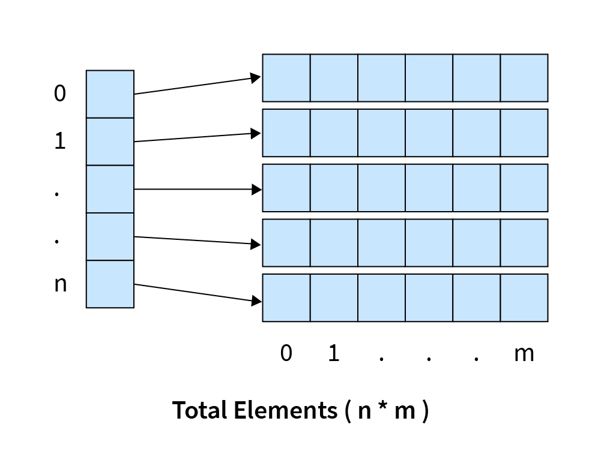

# Liste d'exercices dirigés en préparation au TP jeux de la vie

Langage : python
Niveau : débutant


## Table des matière 

- [Exercices](#exercices)
  - [Exercice 1 : ...](#exercice-1--)


## Exercices 


### Exercice 1 : Découverte des tableaux (une dimension)
Création, affichage, modification
Liste de joueur à un jeux


### Exercice 2 : Tableau en deux dimension
Présentation des tableau à deux dimension
Un tableau à une dimension posède une taille prédéfini. Chaque case du tableau contient une valeur différente.

Dans un tableau à deux dimension, nous avons un tableau qui contient des tableaux. 
La première dimension est notre premier tableau. Et chacune des cases contient une référence vers un autre tableau.

Schéma : 


Pour accéder à une valeur d'un tableau à deux dimention, il faut en premier récupéré le tableau qui contien la valeur que l'on cherche.


```python
# Déclaration d'un tableau
monTableau = [
    [1, 2, 3], # ligne 1
    [4, 5, 6], # Ligne 2
    [7, 8, 9]  # Ligne 3
]

# Je souhaite récupéré la valeur 1 (première case de mon tableau à deux dimension)
# Rappel : l'indice de la première case d'un tableau est toujours "0", et la dernière case est "taille - 1"
print(monTableau[0])    # [1, 2, 3]
print(monTableau[1])    # [4, 5, 6]
print(monTableau[2])    # [7, 8, 9]

ligne = monTableau[0]   # ici "ligne" est un tableau de longueur 3 contenant les valeur 1, 2 et 3
print(ligne[0])         # 1

# Accès simplifié : 
print(monTableau[0][0]) # 1

# Pour avoir la valeur 6 je peut faire:
print(monTableau[1][2]) # 6

# Comme pour un tableau classique, Attention à ne pas sortir du tableau
print(monTableau[3][0]) # IndexError: list index out of range
```


J'organise une crouse en sac, voici les règles.
- 6 coureur
- 5 tours

Je souhaite pourvoir entrer le classement de chaque participant pour chaque tour. Je n'ai besoin que du nom du participant et de l'ordre de passage de la ligne d'arrivé pour le tour.


### Exercice 3 : Tableau 2D, afficher une grille
Affichage d'une grille, chaque case est un caractère


### Exercice 4 : Tableau 2D, modification en live
Affichage du tableau, demande à l'utilisateur un input x/y et affichage d'un caratère à ces coordonnée
Vérification si il est possible de l'ajouter à cet emplacement


### Exercice 5 : 


### Exercice 6 : 


### Exercice 7 : 


### Exercice 8 : 


### Exercice 9 : 


### Exercice 10 : Tableau de String


